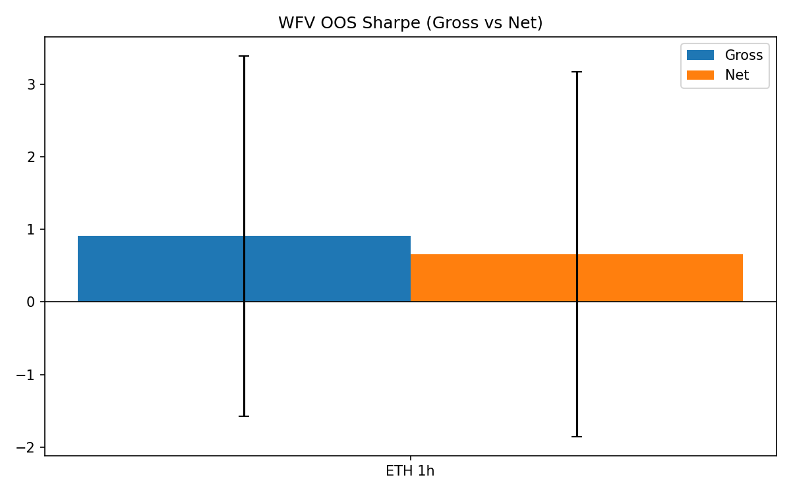
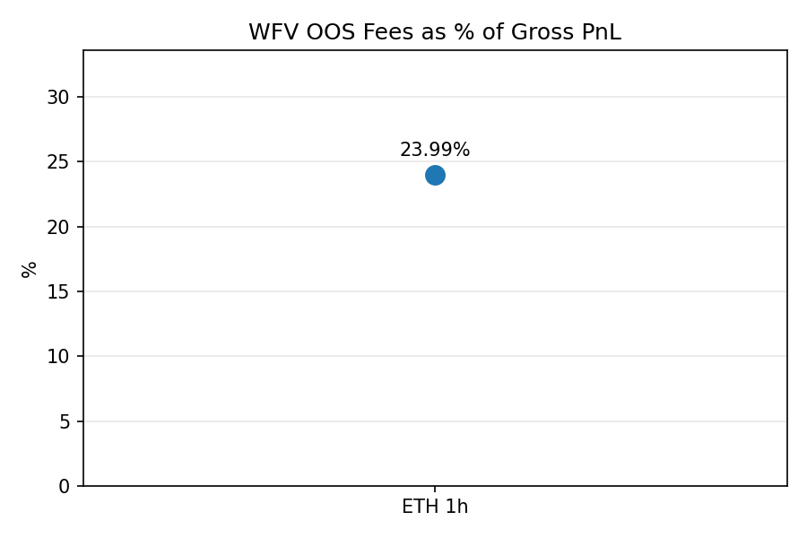
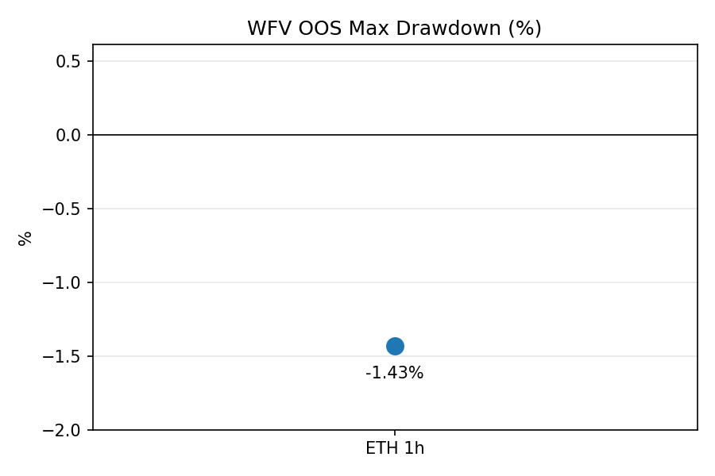

# Crypto Momentum Bot (MACD + ADX + Volatility Targeting)

This repository implements a fully automated crypto momentum bot that combines MACD, ADX gating, and volatility targeting.
It includes both research tooling (parameter sweeps, backtests, walk-forward validation) and an ops-ready paper trading daemon with Docker packaging.

The project demonstrates the end-to-end workflow of modern quant research:
- Alpha discovery and parameter sweeps
- Risk sizing via Moreira–Muir volatility targeting
- Walk-forward validation and research plots
- Deployment to a production-style daemon with idempotency, state persistence, and ops safety

---

A 30-minute MACD+ADX momentum daemon with volatility targeting and idempotent
execution. The scheduler fires on :00/:30 in `America/Indiana/Indianapolis`,
pulls fresh OHLCV, validates parity against the research engine, sizes risk via
Moreira–Muir style vol targeting, and routes paper orders through a broker
adapter.

This repository still ships the research utilities (fast sweeps, backtests), and
includes an ops-ready paper trading stack:

- **`src/bot_daemon.py`** — APScheduler daemon with circuit breaker,
  parity check, signal-safe shutdown, and structured logging.
- **`src/strategy_macd.py`** — Indicator + signal engine using pandas-ta MACD/ADX
  and volatility-targeted sizing.
- **`src/broker.py`** — Paper broker (immediate fills, journal integration)
  with a thin ccxt-backed live skeleton.
- **`src/state.py`** — JSON-backed journal storing run locks, orders,
  positions, cycle metadata, and market marks.
- Single-file YAML configuration in `config/config.yaml` via `src/config.py`, with
  `.env` env-var overrides, `ENV=paper|live`, DRY_RUN toggle, and per-symbol parameters.
- Docker + docker-compose packaging for hands-free deploys.

## 1. Configuration

The daemon reads `config/config.yaml` + environment variables via Pydantic. The simplest path
is to copy `.env.example` to `.env` and tweak values. For per-symbol strategy
overrides, add them to `config/config.yaml` under `strategy_overrides` (see below).

```bash
cp .env.example .env
```

Key settings:

| Variable | Description |
| --- | --- |
| `ENV` | `paper` or `live` (determines broker wiring). |
| `DRY_RUN` | `1` to log intended orders without sending. |
| `SYMBOLS` | Comma-separated CCXT symbols (`BTC/USDT`). |
| `TIMEFRAME` | Candle timeframe (default `30m`). |
| `TZ` | Scheduler timezone (default `America/Indiana/Indianapolis`). |
| `MACD_FAST/SLOW/SIGNAL` | MACD parameters (defaults `8/24/9`). |
| `ADX_THRESHOLD` | ADX gating (default `20`). |
| `VOL_LOOKBACK` | Volatility lookback (default `20` bars). |
| `TARGET_DAILY_VOL` | Daily vol target (default `0.02`). |
| `STARTING_EQUITY` | Paper account starting cash. |
| `MAX_LEVERAGE` | Multiplier applied to target notional (default `1`). |
| `STATE_FILE` | Path to JSON state journal. |
| `LOG_DIR` | Directory for rotating daemon logs. |
| API keys | `PAPER_*` and `LIVE_*` credentials/endpoints. |

Per-symbol overrides live in `config/config.yaml`:

```yaml
strategy_overrides:
  BTC-USD:    # keys can be BTC/USD, BTCUSDT, etc.; forms are normalized
    fast: 8
    slow: 24
    signal: 9
    adx_th: 22
    vol_lb: 30
    daily_vol_target: 0.02
    risk_frac: 0.20
```

This project now uses a single config file; legacy `params.yaml`/JSON are removed.

## 2. Running the daemon locally

```bash
python -m venv .venv
source .venv/bin/activate
pip install -r requirements.txt
python -m src.bot_daemon
```

The scheduler waits `PROCESSING_LAG_SECONDS` (default 20s) after :00/:30, then
runs one cycle per symbol. Logs stream to stdout and to `logs/bot_daemon.log`.
State (orders, run locks, account) persists to `state/bot_state.json` by
default.

### Dry-run vs paper vs live

| Mode | Toggle | Behaviour |
| --- | --- | --- |
| Dry run | `DRY_RUN=1` | Log signals + intended orders, no state changes to cash/positions. |
| Paper | `ENV=paper`, `DRY_RUN=0` | Immediate paper fills via `PaperBroker`, state journal updated. |
| Live | `ENV=live`, `DRY_RUN=0` | ccxt-backed broker skeleton (Binance/Coinbase). Extend with venue specifics before use. |

> **Safety** — the daemon is idempotent per candle via `StateStore.candle_lock`
and will skip duplicate processing. `max_instances=1`, `coalesce=True`, and
`misfire_grace_time` guard against overlapping runs.

## 3. Ops playbook

- **Logs** — inspect `logs/bot_daemon.log` (rotating handler) or container logs.
- **State/journal** — `state/bot_state.json` tracks account, positions,
  last orders, run locks, and per-cycle payloads.
- **Circuit breaker** — after `MAX_API_ERRORS` consecutive failures the
  scheduler pauses; clear by restarting the process (state persists).
- **Manual unlock** — delete the relevant symbol entry in
  `state/bot_state.json` under `run_lock`/`last_processed` if you need to
  reprocess a candle (ensure the daemon is stopped first).
- **Flip to dry run** — set `DRY_RUN=1` (env var or `.env`), restart daemon.
- **Change symbols/params** — edit `.env` (or YAML), restart; no code changes.

Backtest parity runs each cycle (`compute_signal_history` vs legacy
`signal_engine`), logging discrepancies for manual review.

## 4. Docker deployment

A slim container is provided. Build + run via docker-compose:

```bash
docker compose build
docker compose up -d
```

The compose file mounts `./logs` and `./state` for persistence and reads
environment variables from `.env`.

## 5. Testing

Unit tests cover indicator math, sizing, broker idempotency, and state locking.
Run them with:

```bash
pytest
```

## 6. Research toolkit (backtests + parameter sweeps)

The `research/` folder contains reproducible backtests and a flexible sweep engine built around pandas-ta:

- `research/backtest_macd_adx_talib.py` *(legacy filename)*
  - Runs a sanity strategy backtest using pandas-ta MACD/ADX.
  - Suppresses divide-by-zero warnings from Sortino when there are no negative returns.

- `research/sweep_macd_adx.py`
  - Runs grid searches over MACD/ADX/volatility-target parameters.
  - Has three modes and optional overrides:
    - `--mode fast` (default): slimmer grid, fewer folds, quicker iteration.
    - `--mode full`: expanded grid (1h and 4h), more folds.
    - `--mode orig`: original canonical params (MACD 12/26/9, ADX 25, vol_lb 20, target_vol 0.02).
    - `--symbols` to override symbols (e.g., `BTC-USD ETH-USD`).
    - `--timeframes` to override timeframes (e.g., `1h 4h`).

### Run backtests and sweeps (Windows PowerShell)

```powershell
# Backtest sanity check (pandas-ta based)
python research\backtest_macd_adx_talib.py

# Fast parameter sweep
python research\sweep_macd_adx.py --mode fast

# Full sweep across 1h and 4h
python research\sweep_macd_adx.py --mode full

# Original canonical single-combo sweep
python research\sweep_macd_adx.py --mode orig

# Override symbols and timeframes
python research\sweep_macd_adx.py --mode full --symbols BTC-USD ETH-USD SOL-USD --timeframes 1h 4h
```

Outputs (saved next to the sweep script):
- `research/sweep_results_full.csv`: all combos evaluated.
- `research/sweep_results_filtered.csv`: post-filter by minimum trades and basic OOS criteria.
- `research/sweep_walkforward.csv`: light walk-forward validation summary for top-K per symbol.

Data sources and timeframes:
- Primary: Coinbase Advanced 1h OHLCV via CCXT.
- Fallback: yfinance hourly for symbols like `BTC-USD`, `ETH-USD` if Coinbase fetch fails.
- 4h bars are produced by local resampling from 1h in research.

Parameters and live alignment:
- Per-symbol overrides live in `config/config.yaml` under `strategy_overrides`.
  Keys can be `BTC/USD`, `BTC-USD`, `BTCUSDT`, etc.; the loader normalizes common forms.
- Strategy defaults (e.g., MACD 12/26/9, ADX threshold 25, vol lookback 20,
  target_vol 0.02) are set in code and can be overridden by YAML or environment variables.

Paper-trade CSV logging:
- When running the paper bot, each paper order is appended to `logs/paper_trades.csv` with timestamp, symbol, side, qty, price, realized_vol, size_scale, and estimated spread_bps. This complements the persistent state/journal.

---

## 7. Results Snapshot

Walk-forward validation on ETH-USDT (1h bars) with vol targeting:

| Metric | Value |
| --- | --- |
| Avg OOS Gross Sharpe | ~0.91 |
| Avg OOS Net Sharpe | ~0.66 |
| OOS Max Drawdown | -1.43% |
| Fees as % of Gross PnL | ~24% |
| OOS Exposure | 27% |
| OOS Hit Rate | 39% |
| Avg Holding Time | ~15h |

Plots:





---

### File map (new additions)

- `src/bot_daemon.py` — daemon entrypoint.
- `src/strategy_macd.py` — indicator/signal logic.
- `src/broker.py` — broker adapters.
- `src/state.py` — persistent journal + run locks.
- `Dockerfile`, `docker-compose.yml` — container runtime.
- `.env.example` — starter configuration and env-var overrides.

For detailed code structure see inline docstrings and comments.

---

## 9. Why this project matters

This bot is more than a trading experiment — it demonstrates quant + engineering discipline:

- Translating quant research (walk-forward validation, vol targeting, fee impact) into an operational system
- Handling real-world engineering concerns: idempotency, state persistence, config management, ops safety
- Building with production discipline: containerization, environment separation, reproducible research workflows

It serves as both a quant research lab and an ops-ready trading stack.
